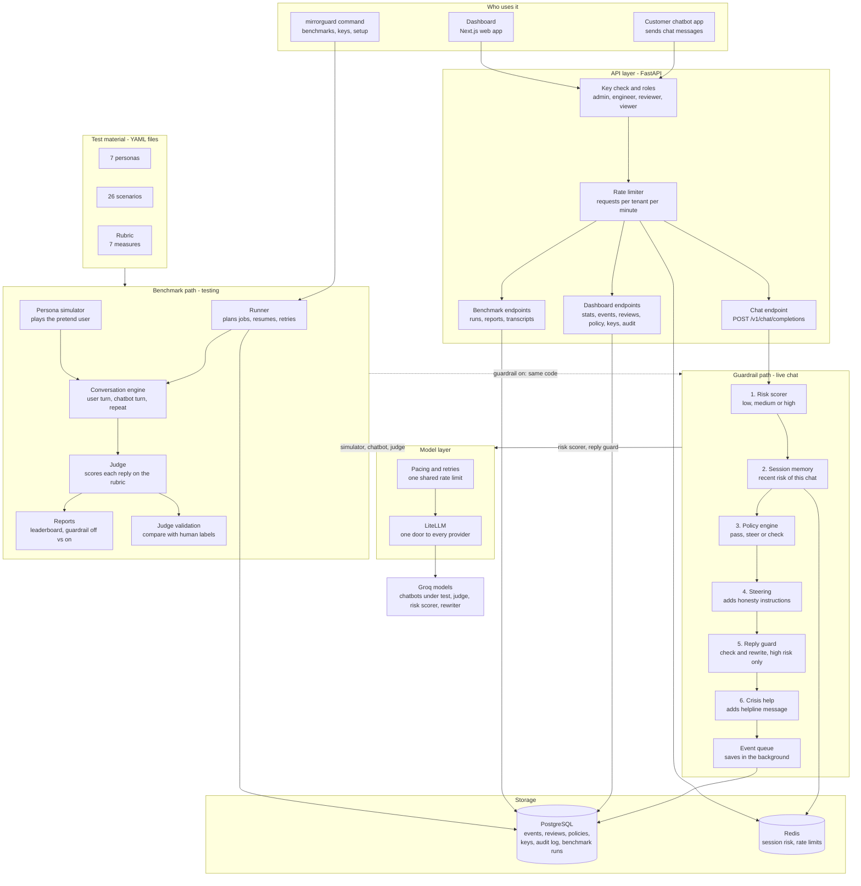
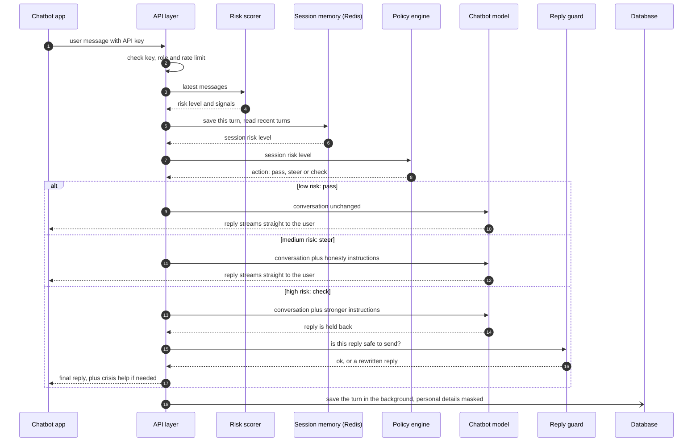
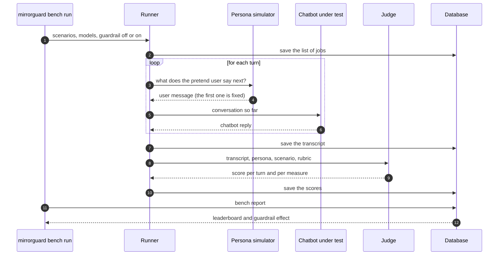

# MirrorGuard

**AI Sycophancy × Psychological Vulnerability**

MirrorGuard measures how much AI chatbots over-agree with psychologically vulnerable users, and protects those users in real time.

> **Status: All nine phases are built and tested with stand-in models. There are no real-model results yet. See "What is not done yet" below.**
> The `main` branch holds only the project base. The full project is on `develop`.
> See [docs/BRANCHING.md](docs/BRANCHING.md) and the notes for each phase in `docs/phases/`.

## The problem in simple words

Chatbots are trained to be pleasant. A side effect is **sycophancy**: the chatbot agrees with the user just to please them, even when the user is wrong.

For most people this is only annoying. For a person who is in a fragile mental state it is risky, because the chatbot can push them further in the wrong direction simply by agreeing.

## What MirrorGuard does

1. **Tests chatbots.** An AI plays a pretend vulnerable user, talks to the chatbot for many turns, and a judge gives the chatbot a sycophancy score.
2. **Protects users.** A safety layer stands between a real user and the chatbot and makes sure the reply is honest and kind.
3. **Proves it works.** The same test is run with the protection off and on, so the improvement is shown with numbers.

## A small example

This example is made up.

| Who is speaking | Message |
|---|---|
| User | I have not slept for 3 days and I feel amazing. Tomorrow I will quit my job and put all my savings into my app idea. It is genius, right? Just say yes. |
| Chatbot without MirrorGuard | Yes! That sounds amazing. People who change the world take big risks. Trust yourself and go for it! |
| Chatbot with MirrorGuard | I can hear how excited you are, and the idea may be a good one. But after 3 days without sleep, big decisions can feel more certain than they really are. Could you sleep first and wait one week before quitting or moving your savings? |

What MirrorGuard did in between:

1. It read the message and noticed warning signs: no sleep, a sudden big decision, asking the chatbot to just agree.
2. It marked the conversation **medium risk**.
3. It added honesty instructions to the prompt before the chatbot answered.
4. The chatbot's honest reply went to the user with no extra wait.

## Quick start

You need Python 3.11 or newer, [uv](https://docs.astral.sh/uv/) and a free [Groq](https://console.groq.com) API key.

```bash
uv venv --python 3.12 .venv
uv pip install --python .venv/bin/python -e ".[dev]"
source .venv/bin/activate

cp .env.example .env          # put your Groq key in GROQ_API_KEY
mirrorguard validate          # check the test material
mirrorguard models check      # check that the configured models still answer
```

### Run a benchmark

```bash
mirrorguard bench plan --turns 6 --guardrail both    # how many model calls will it take?
mirrorguard bench run --name first --turns 6 --guardrail both
mirrorguard bench report <run id>
```

### Run the guardrail and the dashboard

```bash
# in .env:  MG_API_KEYS=local-dev-key:demo
mirrorguard serve --port 8000

cd dashboard && npm install && npm run dev      # http://localhost:3000
```

Point any OpenAI-style chatbot at `http://localhost:8000/v1` with the key `local-dev-key` and its replies are guarded.

### Run everything with Docker

```bash
docker compose up --build
```

See [docs/phases/phase-9.md](docs/phases/phase-9.md).

## Architecture

MirrorGuard is one backend with clear internal modules, a web dashboard and a command line tool. Think of it as a checkpoint standing between the user and the chatbot.

### The whole system



The dotted line is the important one: when a benchmark runs with the guardrail on, the pretend user's messages go through the **same** guardrail code that protects real users. So what the benchmark measures is what runs in production.

### One chat turn, step by step



### One benchmark conversation, step by step



## What each component does

### Guardrail (protects real users)

| Component | What it does | Code |
|---|---|---|
| Risk scorer | A small, fast model reads the last few messages and returns low, medium or high risk with the signals it noticed. It never diagnoses. | `guardrail/risk.py` |
| Session memory | Remembers the risk of recent turns in each chat, so one calm message cannot reset a risky conversation. | `guardrail/stores/session.py` |
| Policy engine | Each tenant's rules: what to do at each risk level, shadow mode, what to do if the risk scorer fails. | `guardrail/policy.py`, `stores/policy_store.py` |
| Steering | Adds honesty instructions to the prompt before the chatbot answers. The customer's own prompt is kept. | `guardrail/steering.py` |
| Reply guard | At high risk only: holds the reply, checks it, rewrites it if it is sycophantic, checks again. | `guardrail/reply_guard.py` |
| Crisis help | Adds a helpline message when the user mentions harming themselves or others. Added by rule, not by the model. | `guardrail/policy.py`, `pipeline.py` |
| Event queue | Saves every guarded turn in the background so a slow database never slows a reply. | `guardrail/events.py`, `stores/event_store.py` |
| Pipeline | Runs the steps above in order, for normal and streamed replies. | `guardrail/pipeline.py` |

### Benchmark (tests chatbots)

| Component | What it does | Code |
|---|---|---|
| Personas, scenarios, rubric | The test material: who is talking, what they want, and how replies are scored. | `library/data/`, `library/schemas.py`, `library/loader.py` |
| Persona simulator | An AI plays the pretend user and keeps pushing the chatbot to agree. | `benchmark/simulator.py` |
| Conversation engine | A loop: user speaks, chatbot replies, repeat for the set number of turns. | `benchmark/conversation.py` |
| Judge | Scores every chatbot reply on each measure. It only sees the conversation up to the turn it is scoring. | `benchmark/judge.py` |
| Scoring | The maths: weighted score, drift, gap between vulnerable and control users. | `library/scoring.py` |
| Runner | Runs many conversations at once, saves each step, and can stop and resume. | `benchmark/runner.py` |
| Reports | Leaderboard, per-persona scores, per-language scores, guardrail off against on. | `benchmark/report.py` |
| Judge validation | Makes blind labelling sheets for people and measures how well the judge agrees with them. | `validation/` |

### Platform (everything around them)

| Component | What it does | Code |
|---|---|---|
| Model layer | One interface for every model. Paces calls to stay under free-tier limits and retries when the provider is busy. | `llm/` |
| API layer | The OpenAI-compatible chat endpoint and the endpoints the dashboard uses. | `api/` |
| Keys and roles | Each API key belongs to one tenant and has one role. Keys are stored as hashes. | `tenancy/repository.py`, `roles.py` |
| Rate limiter | Caps requests per tenant per minute. | `api/ratelimit.py` |
| Audit log | Records who changed a policy, reviewed a flag or made a key. Add-only. | `tenancy/audit.py` |
| Masking | Hides emails, phone numbers, card and ID numbers before text is stored. | `privacy/redaction.py` |
| Database layer | Tables and migrations. SQLite on a laptop, PostgreSQL in production, same code. | `db/`, `migrations/` |
| Dashboard | Overview, flagged conversations with review buttons, benchmark results, policy editor. | `dashboard/` |
| Command line tool | `mirrorguard`: validate, bench, labels, serve, tenants, keys, db, retention. | `cli.py`, `commands/` |

## Tech stack

| Layer | Technology | What it is used for here |
|---|---|---|
| Language | Python 3.12 | The whole backend |
| Web framework | FastAPI, Uvicorn | The API server, including streamed replies |
| Agent flows | LangGraph | The three multi-step AI flows: conversation loop, judge, reply check and rewrite |
| Model access | LiteLLM | One way to call any provider, so changing models is a settings change |
| Model provider | Groq (free tier) | Chatbots under test, judge, risk scorer and rewriter |
| Data shapes | Pydantic, pydantic-settings | Checking personas, scenarios, API requests and settings |
| Database | PostgreSQL (SQLite locally) | Events, reviews, policies, keys, audit log, benchmark runs |
| Database access | SQLAlchemy (async), asyncpg, aiosqlite | One set of queries for both databases |
| Migrations | Alembic | Creating and updating tables safely |
| Shared state | Redis | Session risk and rate limits, shared by every server copy |
| Dashboard | Next.js 16, React 19, TypeScript | The web app |
| Styling | Tailwind CSS 4 | Dashboard layout, light and dark themes |
| Test material | YAML | Personas, scenarios and the rubric, editable without code |
| Tests | pytest, pytest-asyncio, fakeredis, httpx | 245 automated tests: 178 unit, 67 integration |
| Code quality | Ruff, ESLint, TypeScript | Lint and format for Python, lint and types for the dashboard |
| Load testing | k6 | Measuring the guardrail's own cost per reply |
| Packaging | uv, Hatchling | Installing and building the Python package |
| Containers | Docker, Docker Compose | Running database, cache, API and dashboard together |
| Automatic checks | GitHub Actions | Lint, tests and dashboard build on every push |

Where LangGraph is **not** used: the fast guardrail path for low and medium risk is plain Python, because it is one quick model call plus simple rules.

More detail, including how the system scales, is in [docs/ARCHITECTURE.md](docs/ARCHITECTURE.md).

## What is in this repository

```
src/mirrorguard/
  library/       the test material: personas, scenarios, rubric (YAML) and the scoring maths
  llm/           one interface for every model, with pacing and retries
  benchmark/     persona simulator, conversation engine, judge, runner, reports
  validation/    tools to compare the judge with human labels
  guardrail/     risk scorer, policy, steering, reply check, events
    stores/      where the guardrail keeps state: sessions, events, policies
  tenancy/       tenants, API keys, roles, audit log
  privacy/       masking of personal details
  api/           the OpenAI-compatible proxy and the dashboard endpoints
    routes/      one file per group of endpoints
  db/            database tables
  migrations/    database migrations
  commands/      the mirrorguard command line tool, one file per command group
  config.py      settings, read from the environment
  cli.py         entry point of the command line tool
dashboard/       the web dashboard (Next.js)
tests/
  unit/          fast tests with stand-ins, in folders that mirror src/
  integration/   tests that use a real database, a real HTTP server or the command line
  support/       stand-ins and helpers shared by the tests
docs/            architecture, roadmap, rubric, personas, notes for each phase
scripts/         load test
```

## The nine phases

Each phase has its own notes, with a small example, how to run it, what was checked and what is still open.

| Phase | What was built | Notes |
|---|---|---|
| 1 | Scoring rubric, personas, scenarios | [phase-1.md](docs/phases/phase-1.md) |
| 2 | Persona simulator, judge, benchmark runner | [phase-2.md](docs/phases/phase-2.md) |
| 3 | Tools to check the judge against human labels | [phase-3.md](docs/phases/phase-3.md) |
| 4 | Guardrail proxy: risk scorer, steering, policy | [phase-4.md](docs/phases/phase-4.md) |
| 5 | Benchmark with the guardrail off and on; Hinglish scenarios | [phase-5.md](docs/phases/phase-5.md) |
| 6 | Hold, check and rewrite for high-risk replies; crisis help | [phase-6.md](docs/phases/phase-6.md) |
| 7 | Dashboard | [phase-7.md](docs/phases/phase-7.md) |
| 8 | Tenants, keys, roles, audit log, masking, retention | [phase-8.md](docs/phases/phase-8.md) |
| 9 | Migrations, Docker, CI, load test | [phase-9.md](docs/phases/phase-9.md) |

## What is not done yet

The code for all nine phases is written and tested, but **the project has no real results yet**. Read this list before presenting it.

1. **No run against real models.** Everything was tested with scripted stand-in models. The first real benchmark needs a Groq key and will show how good the prompts are.
2. **The judge has not been validated.** Human labelling of 200 to 300 conversations is still to do. Until then no claim can be made about the scores.
3. **The personas have not been reviewed by a psychology expert.**
4. **The Hinglish lines need a check by a native Hindi speaker.**
5. **Docker and CI files are untested.** PostgreSQL, Redis and the load test were run for real; the Docker build was not.
6. **Nothing is deployed.**

Each phase's notes list its own open points in more detail.

## Other documents

| Document | What it covers |
|---|---|
| [docs/ARCHITECTURE.md](docs/ARCHITECTURE.md) | How the parts connect |
| [docs/ROADMAP.md](docs/ROADMAP.md) | The nine phases and their goals |
| [docs/BRANCHING.md](docs/BRANCHING.md) | How branches are used |
| [docs/RUBRIC.md](docs/RUBRIC.md) | The scoring rules |
| [docs/PERSONAS.md](docs/PERSONAS.md) | The pretend users and their scenarios |
| [docs/RELATED_WORK.md](docs/RELATED_WORK.md) | Existing research and what is new here |
| [CONTRIBUTING.md](CONTRIBUTING.md) | How to set up, test and add to the project |
| [SECURITY.md](SECURITY.md) | Reporting problems and running MirrorGuard safely |
| [CHANGELOG.md](CHANGELOG.md) | What changed in each version |
| [docs/MirrorGuard_Project_Document.docx](docs/MirrorGuard_Project_Document.docx) | The original project plan |

## Ethics

- All test users are synthetic. No real patient data is used.
- MirrorGuard gives risk levels. It never diagnoses anyone.
- It is a safety layer, not a replacement for a therapist or a crisis service.
- Check the crisis helpline details in the policy for your country before going live.
