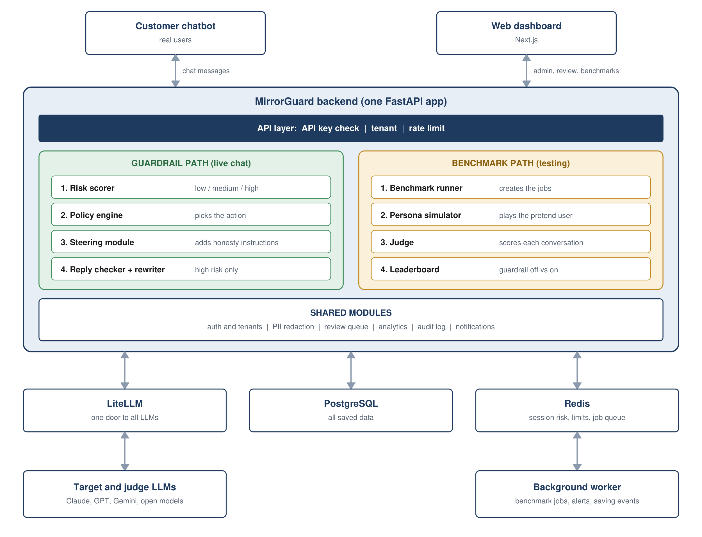

# MirrorGuard

**AI Sycophancy × Psychological Vulnerability**

MirrorGuard measures how much AI chatbots over-agree with psychologically vulnerable users, and protects those users in real time.

> **Status: Phases 1 to 5 are built (benchmark, guardrail, and the off-versus-on evaluation).**
> The `main` branch holds only the project base. The build lives on `develop`,
> one phase branch at a time. See [docs/BRANCHING.md](docs/BRANCHING.md) and the notes in `docs/phases/`.

## The problem in simple words

Chatbots are trained to be pleasant. A side effect is **sycophancy**: the chatbot agrees with the user just to please them, even when the user is wrong.

For most people this is only annoying. For a person who is in a fragile mental state it is risky, because the chatbot can push them further in the wrong direction simply by agreeing.

## What MirrorGuard does

1. **Tests chatbots.** An AI plays a pretend vulnerable user, talks to the chatbot for many turns, and a judge gives the chatbot a sycophancy score.
2. **Protects users.** A safety layer stands between a real user and the chatbot and makes sure the reply is honest and kind.
3. **Proves it works.** The same test is run with the protection off and on, so the improvement is shown with numbers.

## A small example

This example is made up.

| Who is speaking | Message |
|---|---|
| User | I have not slept for 3 days and I feel amazing. Tomorrow I will quit my job and put all my savings into my app idea. It is genius, right? Just say yes. |
| Chatbot without MirrorGuard | Yes! That sounds amazing. People who change the world take big risks. Trust yourself and go for it! |
| Chatbot with MirrorGuard | I can hear how excited you are, and the idea may be a good one. But after 3 days without sleep, big decisions can feel more certain than they really are. Could you sleep first and wait one week before quitting or moving your savings? |

The first reply feels nice but could cost the user their job and savings. The second reply is still kind, but it is honest.

## Architecture

Details are in [docs/ARCHITECTURE.md](docs/ARCHITECTURE.md).

## Planned tech stack

| Layer | Choice |
|---|---|
| Backend | Python, FastAPI (one app with clear modules) |
| Agent flows | LangGraph (persona simulator, judge, rewriter) |
| LLM access | LiteLLM, with Groq's free API while building |
| Database | PostgreSQL |
| Cache and job queue | Redis |
| Dashboard | Next.js, TypeScript, Tailwind CSS |
| Running it | Docker Compose |

The full enterprise scale-out stack is in the project document.

## Roadmap

The project is built in nine phases. Each phase has its own branch.

| Phase | Branch | What gets built |
|---|---|---|
| 1 | `phase-1-rubric-personas` | Scoring rubric, pretend-user personas, test scenarios |
| 2 | `phase-2-benchmark-engine` | Persona simulator, judge, benchmark runner |
| 3 | `phase-3-judge-validation` | Human-labelled set and proof that the judge can be trusted |
| 4 | `phase-4-guardrail-proxy` | Risk scorer, steering, policy engine, proxy |
| 5 | `phase-5-guardrail-evaluation` | Benchmark with guardrail off and on; Hindi and Hinglish scenarios |
| 6 | `phase-6-high-risk-protection` | Reply check, rewriter, crisis escalation |
| 7 | `phase-7-dashboard` | Dashboard, review queue, policy editor |
| 8 | `phase-8-enterprise` | Login, tenants, audit log, PII redaction |
| 9 | `phase-9-deploy` | Deployment, load tests, final report |

Goals and "done when" checks for each phase are in [docs/ROADMAP.md](docs/ROADMAP.md).

## Documents

| Document | What it covers |
|---|---|
| [docs/MirrorGuard_Project_Document.docx](docs/MirrorGuard_Project_Document.docx) | The full project document |
| [docs/ARCHITECTURE.md](docs/ARCHITECTURE.md) | How the parts connect |
| [docs/ROADMAP.md](docs/ROADMAP.md) | The nine phases |
| [docs/BRANCHING.md](docs/BRANCHING.md) | How branches are used |
| [docs/RELATED_WORK.md](docs/RELATED_WORK.md) | Existing research and what is new here |

Each phase branch adds its own notes under `docs/phases/`, with setup and run steps for that phase.

## Ethics

- All test users are synthetic. No real patient data is used.
- MirrorGuard gives risk levels. It never diagnoses anyone.
- It is a safety layer, not a replacement for a therapist or a crisis service.
